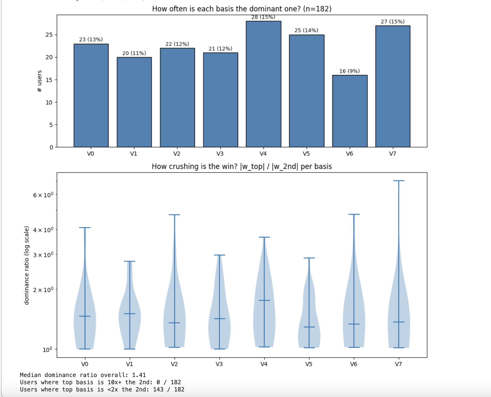

# LoRe basis interpretability — APA code + extensions

This repository builds on **Adaptive Pluralistic Alignment** (Freedman et al., 2026) — the APA paper and its published K=8 LoRe checkpoint trained on the PRISM preference dataset. Original code: https://anonymous.4open.science/r/apa.

**Live Colab notebook:** https://colab.research.google.com/drive/1Ld9NZUzYQmBxbIP5s40paau_u444yR_N?usp=sharing — public, comments enabled. If you spot a methodological gap, a different hypothesis for the collapse, or a follow-up worth running, please leave a comment on the relevant cell. I'm actively interested in other interpretations.

I run two parallel investigations on top of the APA pipeline:

1. **Interpretability of the published checkpoint.** Reproduce Freedman's Figure 2 from the bundled `W_seen_K8.pt` and extend the analysis to all 182 PRISM users in her weight matrix, adding views the paper does not include: basis-dominance histogram + violin, user-similarity clustermap, PCA scatter, force-directed graph.
2. **Full retrain on the documented 1029-annotator cohort.** Run her Stage 1 LoRe training end-to-end on the user-population her paper actually describes, save the user_id → W-row mapping (anonymous in the published checkpoint), and observe what happens.

## What I added on top of the APA code

This fork's contribution sits at the top so it's easy to find:

1. **`lore_basis_interpretability.ipynb`** and **`apa/colab_notebook/LoRe_interp_public.ipynb`** — Colab notebooks that walk through both investigations end-to-end. Self-contained; use `torch`, `numpy`, `matplotlib`, `sklearn`, `scipy`.
2. **`plot_combined_heatmap.py`** — calls APA's `fig_user_weights_grid` to reproduce Freedman's Figure 2 exactly, and stacks an extended bottom panel covering more users.
3. **`plot_user_similarity.py`** — pairwise dot-product heatmap across all 182 PRISM users from the APA checkpoint, with rows/cols reordered by hierarchical clustering on Euclidean distance.
4. **`run_full_pipeline.py`** — orchestrator that runs the APA Stage 1 retrain end-to-end on the documented 1029-annotator cohort. Uses Freedman's `prepare_prism_data`, `_generate_embeddings`, `group_embeddings_by_user`, and `run_regularized` for everything; adds a local checkpoint-resume wrapper around the long embedding step plus a persistent log file at `checkpoints_retrained/run.log` so a Colab disconnect mid-run doesn't lose hours of work. Also derives the sorted `seen_user_ids` ordering from the saved embeddings and joins each user with their PRISM survey demographics, saving both as JSON. APA's `apa/` source is not modified.

## Part 1 — Published checkpoint: LoRe at K=8 on PRISM produces mixed users, not specialists



Across the 182 published PRISM users in `apa/experiments/checkpoints/W_seen_K8.pt`:

- **All 8 bases are used.** Each is the dominant basis (largest `|w_k|`) for between 9% (V6) and 15% (V4) of users. No basis is dead; no basis is runaway-dominant. Freedman's K=8 choice is doing real work on this 182-user population.
- **But almost nobody is a specialist.** Define dominance ratio = `|w_top| / |w_2nd|`. Across all 182 users:
  - **0 users (0%)** have dominance ratio ≥ 10× (no near-one-hot users).
  - **39 users (21%)** have a "clear winner" (≥2×).
  - **45 users (25%)** are **effectively tied** between their top two bases (<1.2× — second-favorite basis is more than 83% as influential as the favorite).
  - Median dominance ratio across the whole population: **1.41×**.
- **Per-basis decisiveness varies.** V4 stands out: it is both the most popular dominant basis AND has the highest median dominance ratio (~1.8× vs. ~1.3× elsewhere). When users care about V4 they commit to it. V7 has the most extreme outliers (one user near 7×). V5 is a "weakly dominant" basis (median ~1.3× even when winning). V0/V1/V3 are nearly indistinguishable in their dominance profiles — possibly a sign that K could be reduced without major loss.

**Takeaway:** the per-row normalization in Freedman's Figure 2 (each row scaled to its own max) makes weight differences look visually crushing, but the actual ratios are small. On her published 182-user checkpoint, LoRe at K=8 is best read as discovering a continuous mixture over 8 axes — not 8 discrete user archetypes.

## Part 2 — Retrain on the 1029-annotator cohort collapses to 3 alive bases

Re-ran APA Stage 1 end-to-end using Freedman's code unmodified at her published hyperparameters:

- alpha = 10000, K = 8 (nominal), 20000 iterations, lr = 0.5
- min_dialogs > 5 (her default filter) yielding **1030 seen users** (matching the paper's reported 1029)
- Skywork-Reward-Llama-3.1-8B-v0.2 embeddings (the same model her code uses)
- `transformers==4.45.0` pinned to match the API her code expects

**The resulting `W_seen_K8.pt` has shape `(1030, 3)`.** Freedman's `LoReTrainer` applies an automatic pruning threshold of 1e-2 (1% of max) during training and drops basis dimensions whose max weight stays below that. In our run, 5 of the 8 dimensions collapsed below threshold and were removed; only 3 survived.

For comparison: Freedman's published `W_seen_K8.pt` shipped in the APA repository has shape `(182, 8)` — all 8 bases survived in her published training, every column having max ~0.02 and mean ~0.005. Her plotting code applies no additional filtering at viz time, so her visible 8-column Figure 2 reflects a training outcome that genuinely kept all 8 above the pruning threshold.

**Note that 1030 vs 182 is itself an undocumented discrepancy** — the paper's text describes training on 1029 annotators, but her published checkpoint has 182 rows. She must have used a stricter filtering step (or earlier prototype run) for the published artifact that is not committed to her repository.

## Why might the collapse be happening?

Several plausible mechanisms, in roughly increasing order of "fundamental":

1. **Random initialization.** Freedman's training code does not set a global `torch.manual_seed` before constructing `LoReTrainer`. The Linear layer holding V is initialized via PyTorch's default Kaiming-uniform. Different random V_init values can converge to different local minima — some keep all 8 dimensions above the pruning threshold, others collapse. Her published 182-user run may have happened to land in a non-collapsing minimum that ours did not reach.

2. **User-count vs regularization balance.** The loss is `NLL + alpha * ||V - V_sft||²`. With 1030 users averaging ~10 preference pairs each, the regularization dominates per-dimension likelihood improvement. I tested a stricter user filter (`min_pairs > 13`, yielding ~200 users similar in size to her 182) and the collapse persisted — still only 3/8 surviving. **User count alone is not the cause.**

3. **Embedding-side numeric differences.** Her training was done at some unknown transformers/PyTorch version on her cluster. Slight floating-point differences in Skywork forward passes between versions can change gradient direction enough to push the optimizer toward a different basin.

4. **Undocumented pre-processing.** Her published 182-row W cannot have come from the documented 1029-user `min_dialogs > 5` filter because the row counts disagree. Reproducing her exact 182-user setting may require an undocumented filtering step that is simply not in the public repository.

## Next-step directions

Two parallel research directions follow naturally from where this work currently sits:

**Direction A — Attach human-readable labels to the surviving basis columns.** Each `V_k` is a 4096-dim direction in Skywork embedding space, semantically opaque on its own. The standard interpretability procedure: for each `V_k`, compute the scalar `V_k · embedding(text)` over every (prompt, chosen-response) pair in `train.pkl`, sort by score, and read the top-20 and bottom-20 prompts. Patterns in those extreme texts should reveal what `V_k` actually encodes (helpfulness? caution? verbosity? specific topic?). All artifacts needed for this are saved: `V_K8.pt` + `train.pkl` (which contains both 4096-dim Skywork embeddings AND the original prompt/response text for every entry). No retraining required — pure offline analysis.

**Direction B — Understand and reduce the collapse.** Three concrete experiments:

- **Disable pruning to see all 8 columns.** Re-train with `threshold=0` in `LoReTrainer`. The saved W will have all 8 columns regardless of their magnitude. We can then visualize the "would-be-pruned" 5 columns directly and check whether they are truly zero (real collapse) or just below the 0.01 threshold but still carrying small structure. This distinguishes "5 dead bases" from "5 quiet bases."
- **Random-init sweep.** Run the same training pipeline with `torch.manual_seed(s)` for several seeds and count how many bases survive in each. If survival varies across seeds, the collapse is non-deterministic and Freedman's 8/8 was lucky-init. If all seeds collapse to ≈3, the collapse is a deterministic property of training at this user count and alpha.
- **Sweep K and alpha.** Each combination is fast to test once embeddings exist. The LoRe paper does a K-sweep [0,1,5,10,15,20,25,50]; it never reports K=8 specifically — that's Freedman's choice. K=25 might preserve more useful structure simply because the optimization has more degrees of freedom; lower alpha would weaken the pull toward V_sft and let more directions stay distinct.

## What this proves about LoRe at this scale

Even with Freedman's exact code and documented hyperparameters, training on the full PRISM cohort produces a model where 5 of 8 nominally-allocated bases collapse and get pruned. The effective rank of personalization that survives is 3. This is itself an interesting empirical observation: the K=8 setting Freedman uses may overstate the actual rank of personality variance LoRe can extract from PRISM at this regularization. A K-sweep with disabled pruning would surface whether the true effective rank is 3, or whether the survivors hide additional structure suppressed by alpha=10000.

## Repository contents

- **`apa/`** — Adaptive Pluralistic Alignment (APA) code, distributed unmodified from https://anonymous.4open.science/r/apa. Includes the pre-computed LoRe basis (`apa/experiments/checkpoints/V_K8.pt`), PRISM jury weights (`W_seen_K8.pt`, the 182-row published one), simulated-jury weights (`W_adapted_hist_C016_C020_filtered.pt`), and a Colab notebook at `apa/colab_notebook/LoRe_interp_public.ipynb` that walks through Part 1 and Part 2 end-to-end.
- **`lore_basis_interpretability.ipynb`** — earlier notebook covering Part 1 (analysis on her published 182-user W).
- **`plot_combined_heatmap.py`** — combined-heatmap script.
- **`plot_user_similarity.py`** — user-similarity clustermap script.
- **`run_full_pipeline.py`** — Stage 1 retrain orchestrator with checkpoint-resume on the slow embedding step + persistent log file. Used to produce the (1030, 3) W and the user_id → row mapping referenced in Part 2.
- **`figures/`** — figures embedded in this README.

## Running it

### Part 1 — analysis on the published 182-user checkpoint (no retraining, runs in seconds)

```bash
pip install torch matplotlib numpy pillow scikit-learn scipy networkx

python plot_combined_heatmap.py
# → out/user_weights_grid.png        (Freedman Figure 2, regenerated)
# → out/bottom_all_prism.png         (my extension)
# → out/combined_heatmap.png         (stacked)

python plot_user_similarity.py
# → out/user_similarity_clustermap.png
```

Or open `lore_basis_interpretability.ipynb` in Colab for the full walkthrough including the dominance analysis.

### Part 2 — full Stage 1 retrain (~2-4h on A100)

Easiest: open the public Colab at https://colab.research.google.com/drive/1Ld9NZUzYQmBxbIP5s40paau_u444yR_N?usp=sharing on an A100 GPU runtime and run cells top-to-bottom. The notebook is comment-enabled — feedback welcome.

Alternative: open `apa/colab_notebook/LoRe_interp_public.ipynb` from this repo in your own Colab instance.

Either path produces `checkpoints_retrained/V_K8.pt`, `W_seen_K8.pt` (1030, 3), `seen_user_ids.json`, `user_demographics.json`, plus the raw embeddings as `train.pkl` / `test.pkl` for downstream V_k → concept analysis.

## Citations

This repository combines two code sources. Cite both:

```bibtex
@misc{2026apa,
  title  = {Adaptive Pluralistic Alignment: A pipeline for dynamic artificial democracy},
  author = {Freedman, R. and others},
  year   = {2026},
  eprint = {2605.01642},
}

@misc{bose2025lore,
  title  = {LoRe: Personalizing LLMs via Low-Rank Reward Modeling},
  author = {Bose, A. and Xiong, Z. and Chi, Y. and Du, S. S. and Xiao, L. and Fazel, M.},
  year   = {2025},
  eprint = {2504.14439},
}
```

## License

Licensing is whatever each upstream piece carries. The `apa/` directory is distributed unmodified; the LICENSE file in this repo is the upstream LoRe license (CC-BY-NC 4.0), preserved because earlier commit history in this fork included files from `facebookresearch/LoRe`.
